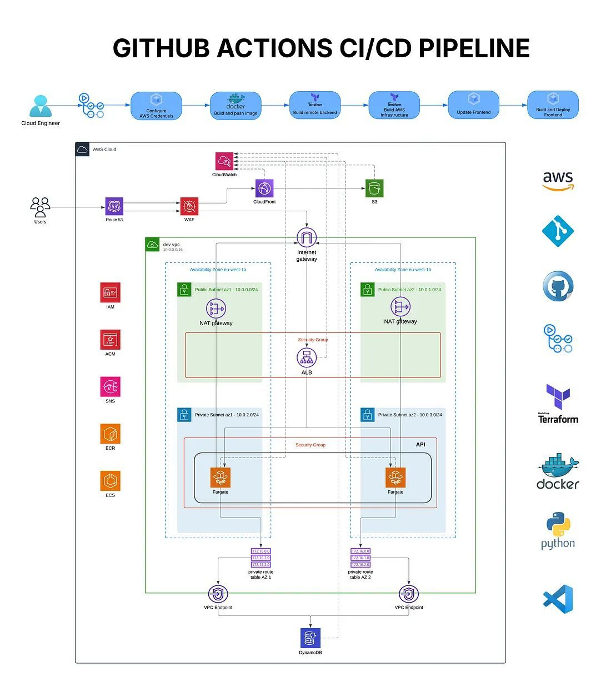

# 🍸 CocktailDB API


Welcome to CocktailDB, a free, open-source API for cocktail enthusiasts and developers. This project provides a comprehensive collection of cocktail data and is built with a robust, scalable, and production-ready infrastructure on AWS.

## ✨ Features

- **Extensive Cocktail Data:** Access a rich database of cocktails, ingredients, and recipes.
- **RESTful API:** A well-structured API built with Django REST Framework.
- **Scalable Infrastructure:** Deployed on AWS with ECS for container orchestration, ensuring high availability and scalability.
- **Automated CI/CD:** A full CI/CD pipeline for automated testing, building, and deployment.
- **Interactive API Documentation:** Explore the API with Swagger (OpenAPI) documentation.

## 🛠️ Tech Stack

- **Backend:** Python, Django, Django REST Framework
- **Database:** PostgreSQL on AWS RDS
- **Infrastructure:** Terraform, AWS (ECS, ECR, RDS, S3, VPC, ALB)
- **CI/CD:** GitHub Actions
- **Containerization:** Docker

## 🏗️ Infrastructure & Deployment

The entire infrastructure for this project is managed using **Terraform**, ensuring that it is versioned, reusable, and easy to manage. The application is deployed on **Amazon Web Services (AWS)** using the following services:

- **Amazon ECS (Elastic Container Service):** Manages the containerized Django application, ensuring it runs reliably and scales as needed.
- **Amazon ECR (Elastic Container Registry):** Stores the Docker images for the application.
- **Amazon RDS (Relational Database Service):** Hosts the PostgreSQL database, providing a managed, secure, and scalable database solution.
- **Application Load Balancer (ALB):** Distributes incoming traffic across the containers, ensuring high availability.
- **Amazon S3 (Simple Storage Service):** Stores static assets and media files.
- **Amazon VPC (Virtual Private Cloud):** Provides a secure and isolated network environment for the application.

### CI/CD Pipeline

The project uses a **CI/CD pipeline** with GitHub Actions to automate the deployment process. When changes are pushed to the `main` branch, the pipeline automatically:

1. **Builds** the Docker image for the application.
2. **Pushes** the image to Amazon ECR.
3. **Updates** the ECS service to deploy the new version of the application.

This ensures that the latest changes are always deployed quickly and reliably.

## 🏛️ AWS Architecture

The application is deployed on a custom VPC with public and private subnets for security. The architecture is designed to be scalable, secure, and highly available.

- **VPC & Networking:** A custom Virtual Private Cloud (VPC) provides a secure and isolated network environment. It includes public subnets for internet-facing resources like the Application Load Balancer, and private subnets for backend resources like the ECS containers and the RDS database.
- **Application Load Balancer (ALB):** The ALB serves as the single point of contact for clients and distributes incoming application traffic across multiple targets, such as ECS tasks, in multiple Availability Zones. This increases the availability of the application.
- **ECS (Elastic Container Service):** The Django application and Nginx reverse proxy are containerized using Docker and deployed as an ECS service. ECS handles the orchestration of the containers, including starting, stopping, and scaling the number of containers based on demand.
- **RDS (Relational Database Service):** A PostgreSQL database is provisioned using RDS. It is deployed in a private subnet to restrict direct access from the internet, and it only allows connections from the ECS service.
- **Security Groups:** Security groups act as a virtual firewall for the instances to control inbound and outbound traffic. They are used to restrict traffic between the ALB, ECS containers, and the RDS database.

Below is a diagram illustrating the architecture:



## 🚀 Run Locally

To run the project locally, follow these steps:

1.  **Clone the repository:**
    ```bash
    git clone https://github.com/carlagesa/CocktailDB.git
    cd CocktailDB
    ```

2.  **Set up a virtual environment:**
    ```bash
    python -m venv venv
    source venv/bin/activate  # On Windows, use `venv\Scripts\activate`
    ```

3.  **Install the dependencies:**
    ```bash
    pip install -r requirements.txt
    ```

4.  **Run the database migrations:**
    ```bash
    python manage.py migrate
    ```

5.  **Start the development server:**
    ```bash
    python manage.py runserver
    ```

## 💾 Populating the Database

The database can be populated with cocktail data using custom Django management commands.

### From TheCocktailDB API

To populate the database with data from the public TheCocktailDB API, run the following command. This will fetch cocktails and ingredients and load them into your database.

```bash
python manage.py populate_from_api
```

### From an Excel File

Alternatively, if you have cocktail data in an Excel file (`data/cocktail_data.xlsx`), you can use the following command to populate the database:

```bash
python manage.py populate_db_from_excel
```

## � Deployment to AWS

This project can be deployed to AWS either manually or via an automated CI/CD pipeline.

### 1. Manual Deployment

A manual deployment involves provisioning the infrastructure with Terraform, building and pushing Docker images, running database migrations, and updating the ECS service.

**Prerequisites:**
- AWS CLI configured with the necessary permissions.
- Terraform installed.
- Docker installed.

#### Step 1: Provision Infrastructure with Terraform

1.  Navigate to the `terraform` directory:
    ```bash
    cd terraform
    ```

2.  Initialize Terraform:
    ```bash
    terraform init
    ```

3.  Create a `terraform.tfvars` file. This file will contain your specific configuration, such as your AWS region and database credentials. You can use `variables.tf` as a reference.

4.  Apply the Terraform configuration to create the AWS infrastructure:
    ```bash
    terraform apply
    ```
    This will provision the VPC, ECS cluster, RDS database, Application Load Balancer, and other required resources.

#### Step 2: Build and Push Docker Images

The application uses two Docker containers: one for the Django application and one for the Nginx reverse proxy.

1.  **Log in to Amazon ECR:**
    Replace `<aws_account_id>` and `<aws_region>` with your details.
    ```bash
    aws ecr get-login-password --region <aws_region> | docker login \
        --username AWS --password-stdin \
        <aws_account_id>.dkr.ecr.<aws_region>.amazonaws.com
    ```

2.  **Build and push the Django app image:**
    From the root of the project directory:
    ```bash
    docker build -t <aws_account_id>.dkr.ecr.<aws_region>.amazonaws.com/django-app:latest .
    docker push <aws_account_id>.dkr.ecr.<aws_region>.amazonaws.com/django-app:latest
    ```

3.  **Build and push the Nginx image:**
    The Nginx image should be built using the `nginx` directory as the build context to keep the image small and secure.
    ```bash
    docker build --no-cache -t <aws_account_id>.dkr.ecr.<aws_region>.amazonaws.com/nginx:latest nginx
    docker push <aws_account_id>.dkr.ecr.<aws_region>.amazonaws.com/nginx:latest
    ```

#### Step 3: Run Database Migrations

Before deploying the new version of the application, you need to run database migrations. In a production environment, it's best to run migrations as a one-off task in ECS to ensure that the database schema is updated before the application starts.

You can run the `migrate` command as an ECS task, using the same task definition as your application, but overriding the command to `python manage.py migrate`. This can be done via the AWS Management Console or the AWS CLI.

#### Step 4: Update the ECS Service

After pushing the new images and running migrations, you can update the ECS service to deploy the new container versions. This project includes a Python script to simplify this process.

The `deploy/update-ecs.py` script updates the task definition with a new container image and then updates the service to use the new task definition.

1.  **Update the Django application:**
    ```bash
    python deploy/update-ecs.py \
      --cluster <your-cluster-name> \
      --service <your-service-name> \
      --image "<aws_account_id>.dkr.ecr.<aws_region>.amazonaws.com/django-app:latest" \
      --container-name django-app
    ```

2.  **Update the Nginx container:**
    ```bash
    python deploy/update-ecs.py \
      --cluster <your-cluster-name> \
      --service <your-service-name> \
      --image "<aws_account_id>.dkr.ecr.<aws_region>.amazonaws.com/nginx:latest" \
      --container-name nginx
    ```

Alternatively, you can update the service directly using the AWS CLI if you know the new task definition revision:
```bash
aws ecs update-service \
  --cluster <your-cluster-name> \
  --service <your-service-name> \
  --task-definition <task-definition-family>:<revision>
```

### 2. Automated Deployment (CI/CD)

The project is configured with a CI/CD pipeline using GitHub Actions. To trigger the pipeline, simply push your changes to the `main` branch. The pipeline automates all the manual steps described above.

## 🧪 Testing

This project uses Django's built-in testing framework. The tests are located in the `cocktails/tests.py` file and are run as part of the CI/CD pipeline to ensure that new changes do not break existing functionality.

To run the tests locally, use the following command:
```bash
python manage.py test
```

## 🛡️ Security

Security is a top priority for this project. The following security measures have been implemented:

- **IAM Roles:** The application uses IAM roles with the principle of least privilege to ensure that the ECS tasks and other resources only have the permissions they need to function.
- **Security Groups:** Security groups are used as a virtual firewall to control inbound and outbound traffic to the application and database.
- **Secrets Management:** Sensitive information, such as database credentials and secret keys, are not hardcoded in the source code. Instead, they are managed using `terraform.tfvars` and passed to the application as environment variables.
- **Private Subnets:** The RDS database is located in a private subnet, which means it is not directly accessible from the internet.

## 🗺️ Future Improvements

This project is under active development. Here are some of the features and improvements planned for the future:

- **User Authentication:** Implement JWT-based authentication to allow users to register, log in, and receive tokens for accessing protected endpoints.
- **Enhanced Search & Filtering:** Implement more advanced search capabilities, such as filtering cocktails by multiple ingredients, categories, or alcoholic content.
- **API Rate Limiting:** Add rate limiting to prevent abuse and ensure fair usage for both authenticated and anonymous users.
- **Caching Layer:** Introduce a caching layer (e.g., with Redis) to improve API response times for frequently requested data.
- **User-Generated Content:** Allow authenticated users to submit their own cocktails and recipes.
- **Cocktail Ratings and Reviews:** Enable users to rate and review cocktails.
- **Comprehensive Test Coverage:** Expand test coverage to include more integration and end-to-end tests.

## 📚 API Reference

The API documentation is generated using Swagger and is available at the API endpoint. Once you have the server running, you can access it at `http://127.0.0.1:8000/swagger/`.

## 📸 Screenshots

**Swagger API Documentation:**


**Successfully Imported Cocktail Data:**


## 🙌 Contributing

Contributions are welcome! Please see the [CONTRIBUTING.md](CONTRIBUTING.md) file for details on how to get started, including our branching strategy and pull request process.

## 📜 License

This project is licensed under the MIT License. See the [LICENSE](LICENSE) file for details.

## 👨🏾‍💻 Author

- **Carl Agesa** - [GitHub](https://github.com/carlagesa)

For project opportunities, please check out my GitHub profile for social links.
